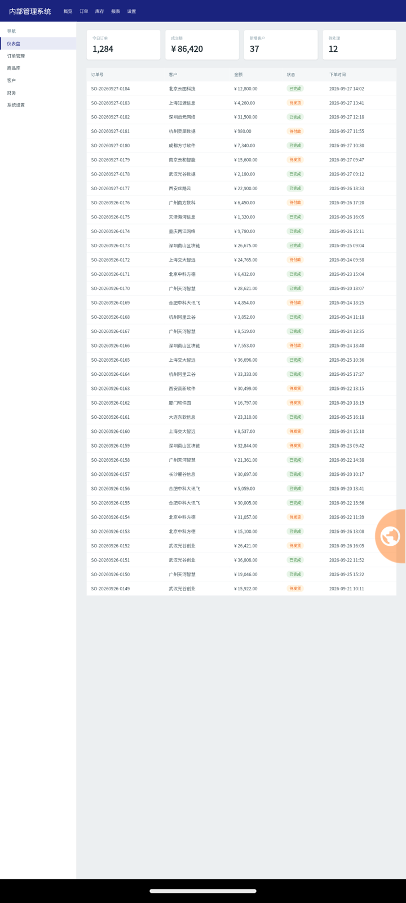
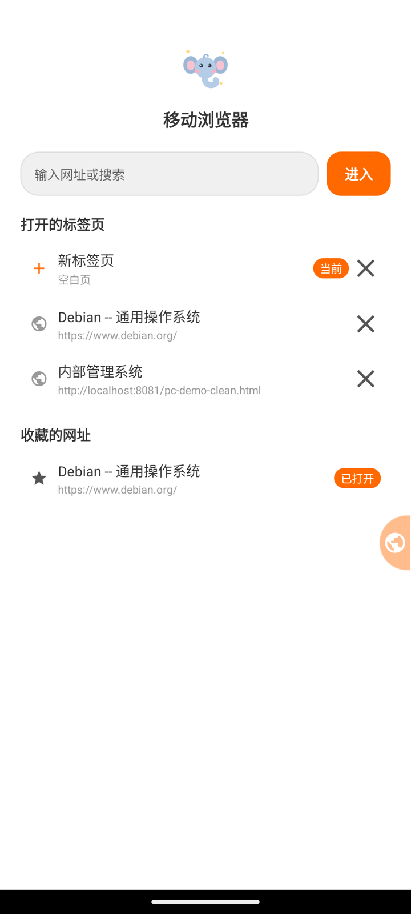
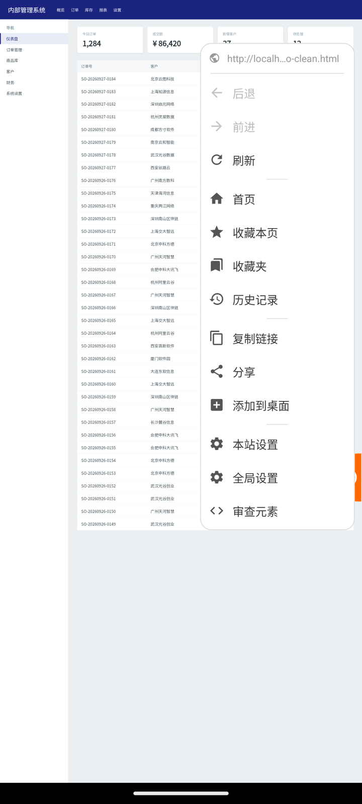
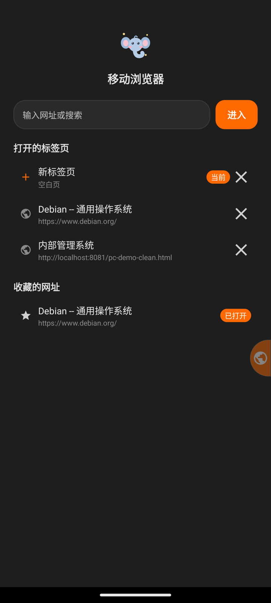
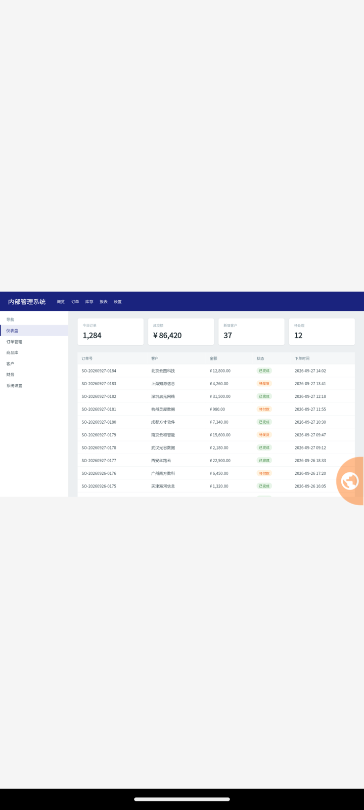
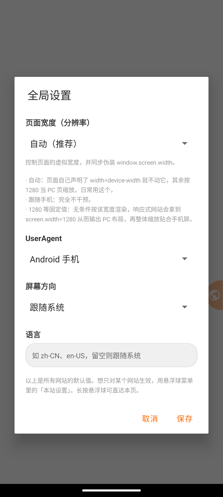
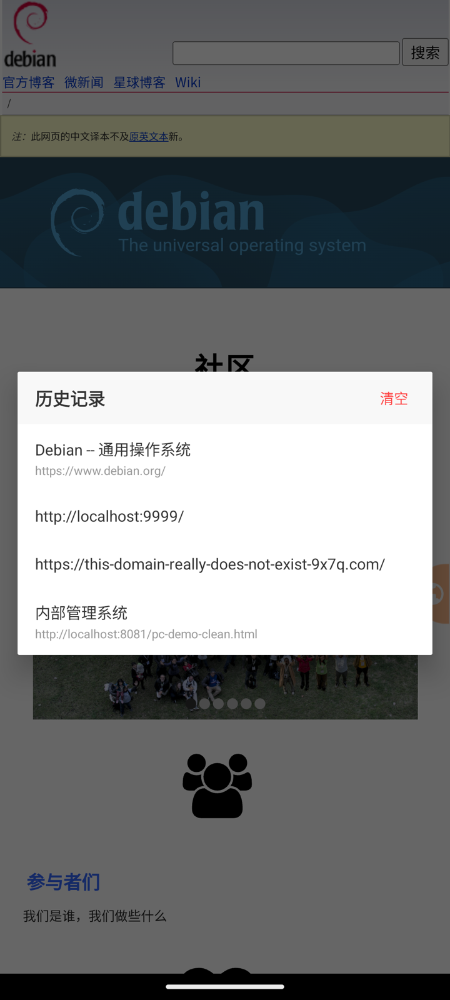
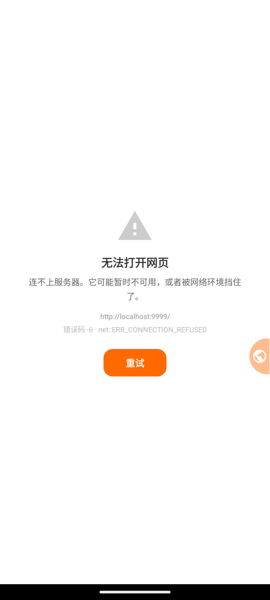

# 移动浏览器 · Blauser

> 让 PC 网页在手机上真正能用。

**📦 [下载 APK](https://github.com/SmartXiaoMing/blauser/releases/latest)** · 1.8 MB · Android 5.0+ · [MIT 协议](LICENSE)

一个 Android 浏览器，只专注做一件事：**那些没有做移动端适配的网页，在手机上也得好用。**

手机上打开这类网站，体验通常是灾难 —— 字小到要放大镜、排版整个错位、
按钮挤在一起点不中、表格横向溢出。它们本来就是按 1280px 的桌面屏设计的，
而手机浏览器的默认行为是「按移动端 viewport 渲染」，两边对不上。

Blauser 反过来做：**按 PC 的宽度渲染，再整体缩放贴合手机屏。**
同时伪装 `window.screen.width`，让响应式站点主动吐出 PC 布局。
于是后台管理系统、老论坛、文档站、政府网站这些「只在电脑上能看」的页面，手机上也能用了。

<p align="center">
  
  
  
  
</p>

<p align="center">
  <sub>左起：PC 页面缩放 · 新标签页 · 悬浮球菜单 · 深色模式</sub>
</p>

---

## 它和普通手机浏览器有什么不同

**1. 不是「缩放到适应」，是「按桌面布局渲染后再缩放」**

普通浏览器把桌面页硬塞进 375px 宽，结果是断行错乱、侧边栏盖住正文。
Blauser 让页面按 1280px（或你指定的宽度）正常排版 —— 该并排的并排、该分栏的分栏 ——
然后等比缩放到手机屏。你看到的是完整的桌面布局，只是小了一号，双指放大即可看清。

而且它**会判断**：页面自己声明了 `width=device-width`（说明它做了移动端适配），
就完全不干预，保持原生渲染。所以淘宝、知乎这类站点仍然是正常的移动端体验，
只有真正的 PC 页面才被接管。

**2. 界面上只有一个控件**

没有状态栏、没有地址栏、没有标签栏、没有底部导航 —— 网页铺满整屏。
所有操作（后退、刷新、收藏、历史、复制链接、设置……）都从屏幕边缘那个 **32dp 宽的半球**进出。
短按弹菜单，长按直达设置，可拖动、自动贴边、位置记忆、空闲时半透明不挡内容。
无痕模式下这个半球会变成深色 —— 它是界面上唯一能承载「这个标签不留痕」这个信息的地方。

**3. 标签页就是系统任务**

每个标签跑在独立的 Android task 里，会出现在系统「最近任务」中各占一张卡片。
切换标签 = 切换任务，用系统的手势就能完成，不需要在浏览器里再找一层标签列表。
而且因为这些 task 共享同一个进程，**cookie / localStorage 照常共享**，登录态不会丢。

**4. 一个网站一套设置**

有些站点只在特定配置下才正常 —— 只认桌面 UA、必须横屏、要特定语言。
与其来回改全局设置，不如**按域名记一份覆盖**：离开这个站点自动失效，
没覆盖的项跟随全局。还提供「桌面模式 / 移动模式」一键预设。

**5. 该有的浏览器能力都不缺**

文件上传、下载、摄像头 / 麦克风 / 定位、三方 cookie（很多站点的内嵌登录靠它）、
深色模式、添加到桌面。不用因为「某个功能它没有」而临时切回别的浏览器。

---

## 功能一览

### 显示

- **PC 页面自动适配**：自动判断页面类型，PC 页面按桌面宽度渲染后整体缩放
- **分辨率可选**：`自动`（默认）/ `跟随手机` / `1280 × 720` / `1366 × 768` /
  `1024 × 768` / `800 × 600` / `自定义`
  - 预设档**只定宽度**：按该宽度排版，再整体缩放贴合手机屏宽，纵向照常滚动。
    同时伪装 `window.screen.width`，响应式网站会据此输出 PC 布局
  - **自定义**可以精确填「宽 × 高」。填了高度就按这个比例模拟一块屏幕：
    等比缩放、四周留白（下图就是自定义 1280 × 720 的效果）。
    高度留空表示不限高，退化成只按宽度缩放
- **UserAgent 可选**：Android 手机 / 桌面 Chrome / iPhone Safari / 自定义
- **深色模式**：跟随系统
- **屏幕方向**：跟随系统 / 竖屏 / 横屏
- **语言**：同时作用于 `Accept-Language` 请求头和 `navigator.language`
- 以上每一项都可以**按域名单独覆盖**

<p align="center">
  
  <br>
  <sub>自定义分辨率 1280 × 720：按 16:9 渲染，上下留白，内容不变形</sub>
</p>

### 操作

- **悬浮球**：贴**长边**的半球 —— 竖屏贴左右、横屏自动横过来贴上下；
  可拖动、自动贴边、位置记忆、空闲半透明。贴顶边时会避开刘海
  - 短按展开菜单：后退 / 前进 / 刷新 / 首页 / 新建无痕标签 / 收藏本页 / 收藏夹 /
    历史记录 / 复制链接 / 分享 / 添加到桌面 / 本站设置 / 全局设置 / 审查元素
  - 长按直达设置
  - 无历史时「后退 / 前进」置灰；空白标签上「收藏 / 复制链接 / 分享 /
    添加到桌面 / 本站设置」置灰 —— 这些都要有网页才有意义
  - 已收藏时「收藏本页」变成「取消收藏」
  - 设备不支持无痕（见下）时，那一项**不显示**而不是置灰 ——
    摆一个永远点不动的灰色项只会让人困惑
- **新标签页 / 首页**（定制页面）：
  - 地址输入框 —— 输入网址或搜索词；自动补全协议，
    `localhost:3000` 这类本地地址补 `http://`，其余补 `https://`
  - **打开的标签页**列表，点击即切换；无痕标签带「无痕」角标
  - **收藏的网址**列表，点击打开；若该网址已经开着，则切过去而不是重复开

### 隐私

- **无痕标签**：独立存储，cookie / localStorage / 缓存与普通标签**完全隔离**，
  关闭后整份数据销毁。也不写浏览历史。
  依赖 WebView 的多 profile 能力，条件有两个：**Android 9 及以上**，
  **且 WebView 本身支持多 profile**（较新版本的 WebView）。
  两者缺一就不显示这个入口 —— 而不是做个「不记历史但 cookie 照样共享」的假的。
  实际判断走 `WebViewFeature.isFeatureSupported(MULTI_PROFILE)`，两个条件都包含。
- **浏览历史**：记录访问过的页面，同一网址只留一条并置顶，上限 500 条，
  可一键清空（清空有二次确认）。无痕标签不写历史。

### 网页能力

- 文件上传（`<input type="file">`，支持多选）
- 下载（走系统 DownloadManager，透传 cookie 与 UA，完成后可在系统「下载」里看到）
- 摄像头 / 麦克风 / 定位（网页请求时才向你申请权限）
- 三方 cookie
- 添加到桌面：把当前网页固定成桌面快捷方式，点击以独立任务打开

### 界面语言

中文 / English，跟随系统。文案全部走 `strings.xml`，加一门语言只需再加一份
`values-<语言>/strings.xml`。

### 系统集成

- 注册为系统默认浏览器，其他 App 点链接可以直接用这个打开（会开新标签，不打断当前页面）

### 更多截图

<p align="center">
  
  
  
</p>

<p align="center">
  <sub>设置面板 · 历史记录 · 自定义错误页（按错误码给出中文原因，替代系统那张 “net::ERR_…”）</sub>
</p>

---

## 安装

### 直接装 APK

**[到 Releases 页下载最新版](https://github.com/SmartXiaoMing/blauser/releases/latest)** · 1.8 MB

- 需要 Android 5.0（API 21）及以上
- 没有上架任何应用商店，首次安装需在「设置 → 安全」里允许安装未知来源的应用
- Release 页面里附有 APK 的签名 SHA-256，可自行核对

装好后可以去系统「设置 → 应用 → 默认应用 → 浏览器应用」里把它设成默认浏览器。

### 自行构建

```bash
git clone https://github.com/SmartXiaoMing/blauser.git
cd blauser
./gradlew assembleRelease
# 产物：app/build/outputs/apk/release/blauser-<版本号>.apk
adb install -r app/build/outputs/apk/release/blauser-1.0.1.apk
```

**环境要求**：JDK 17+、Android SDK（`local.properties` 里写 `sdk.dir=...`）。
Gradle 用仓库自带的 wrapper 即可，不需要另装。

---

## 使用

- **打开网页**：点悬浮球 → 首页 → 输入网址或搜索词
- **新开标签**：首页里点「空白页」那一行，或在网页里点 `target="_blank"` 链接
- **切换标签**：用系统的最近任务手势（每个标签是一张独立卡片），
  或者从首页的「打开的标签页」列表里点
- **关闭标签**：首页列表里点该行右侧的 ×，或者在最近任务里划掉
- **收藏**：悬浮球 → 收藏本页
- **针对某个网站改设置**：悬浮球 → 本站设置
- **审查元素**：悬浮球 → 审查元素（仅 debug 包开启远程调试）

---

## 已知限制

这些是设计上明确接受的取舍，不是 bug。

| 场景 | 页面状态是否保留 | 说明 |
|---|---|---|
| 切换标签页、切到后台再回来 | ✅ 完整保留 | DOM / JS 变量 / 滚动位置 / 表单输入都在 |
| 屏幕旋转 / 改字体大小 / 改语言 | ✅ 完整保留 | 已声明 `configChanges`，Activity 不重建 |
| **切换深色模式** | ⚠️ 页面会重载 | 不重建 Activity 就没法给界面换肤。前进后退历史与滚动位置会保住 |
| **后台标签被系统回收** | ❌ 页面会重载 | 见下。URL、前进后退历史、滚动位置可恢复，DOM 与表单内容不行 |
| 主动刷新 / 渲染进程被回收 | ❌ 会重载 | 符合预期 |

**为什么后台标签会被回收**：标签改成独立 task 后，后台 task 的 Activity 处于 stopped 状态，
内存紧张时系统可以销毁它。这与「切回来绝不重载」不可兼得 —— 把所有标签的 WebView
塞进同一个前台 Activity 可以 100% 保证不重载，但那样就没法在最近任务里分卡片了。
**本项目选择后者，并明确接受前者的代价。**

被回收后能恢复到什么程度：**URL、前进后退历史（`WebView.saveState`）、滚动位置**。
**恢复不了 DOM 和表单内容** —— WebView 没有序列化页面状态的接口，
硬做只能自己拦截每个输入框，代价远大于收益。

**其它限制**：

- **无痕标签需要 Android 9 及以上，且 WebView 支持多 profile**。两个条件缺一都做不出
  真隔离（WebView 的多 profile 是随 WebView 版本走的，跟系统版本不完全同步）——
  与其做个「假装无痕」，不如不提供这个入口
- 滚动位置是**尽力而为**：页面重载后要等排版稳定（图片撑开高度、懒加载补内容），
  恢复得太早会被后续布局吃掉。代码里是固定延迟 300ms，极端页面可能不准
- 不接受无效证书，也不提供「继续访问」—— 接受无效证书等于放弃中间人攻击防护

---

## 技术方案

- **语言**：Kotlin + viewBinding。配色与文案全部走资源
  （`colors.xml` + `values-night` + `strings.xml`），没有散落的硬编码
- **最低版本**：Android 5.0（API 21），targetSdk 34

### 标签模型

一个 `MainActivity` 实例 = 一个标签页 = 一个 Android task。
开新标签用 `Intent(FLAG_ACTIVITY_NEW_DOCUMENT or FLAG_ACTIVITY_MULTIPLE_TASK)` 启动新实例，
系统即为它创建独立 task 与最近任务卡片。

每个标签的启动 Intent 带一个唯一的 data URI（`blauser://tab/<uuid>`）作为稳定标识 ——
实测 task 的 `baseIntent` 会保留它，因此可以据此枚举标签、`moveToFront()` 切过去、
`finishAndRemoveTask()` 关掉。

**这个标识必须唯一**：外部 App 用 `ACTION_VIEW` 调起时，Intent 的 data 是**网址本身**，
不能拿来当标签标识 —— 同一个网址被打开两次会撞成同一个 key，
导致两个标签的状态互相覆盖、关一个还关俩。所以这类 Intent 不会被就地加载，
而是转交给一个带 uuid 的正经标签页。

### 缩放原理

注入 JS 改写 `viewport` meta 并计算 scale；固定档位模式下同时用
`Object.defineProperty` 伪装 `window.screen.width` / `availWidth`。

「自动」档在 `DOMContentLoaded` 判断（此时 `<head>` 已解析完，比 `onPageFinished` 早得多，
能明显减少重排闪烁）：

| 页面类型 | 判定 | 处理 |
|---|---|---|
| 有 `width=device-width` | 移动端适配页 | 不干预，保持原生渲染 |
| 无 viewport meta 或固定宽度 | PC 页面 | 按 1280 渲染后整体缩放贴合屏幕 |

### 安全上的取舍

- **混合内容**用 `MIXED_CONTENT_COMPATIBILITY_MODE`：放行 http 图片等被动资源，
  但拦下 http 脚本
- **`allowFileAccess` / `allowContentAccess` 关闭**：地址栏已经只放行
  `file:///android_asset/`，但 API 30 以下这两项默认是 true，多一道防线
- **外部协议跳转要求用户手势**：没有手势的 `weixin://` / `intent://` 跳转一律拦下 ——
  网页静默拉起 App 是最常见的骚扰与诱导手段（Chrome 同样策略）。
  弹窗（`window.open`）也只放行用户点出来的
- **`intent://` 另做了三处加固**：
  清掉解析出来的 component / selector（否则网页能借本 App 的身份去拉起别的应用里
  **没有导出**的组件，即 Google 所说的 Intent Redirection）；
  `startActivity` 连 `SecurityException` 一起捕获（目标未导出或带 `android:permission`
  时抛的是它，只捕 `ActivityNotFoundException` 会让恶意网页直接搞崩 App）；
  `browser_fallback_url` 必须是 http/https —— 它完全由网页控制，
  放行 `javascript:` 会在当前页面上下文里执行脚本
- **证书错误不提供「继续访问」**
- **`allowBackup="false"` + 备份规则全排除**：应用数据目录里有 WebView 的 cookie /
  localStorage，那是用户登录态，不该跟着云备份或换机迁移走

---

## 开发

```
app/src/main/java/com/blauser/browser/
├── MainActivity.kt          # 一个实例 = 一个标签页；生命周期、覆盖层、回调分发
├── TabRegistry.kt           # 标签 = task 的枚举 / 切换 / 关闭 + 各标签状态登记
├── WebViewFactory.kt        # 唯一构造 WebView 的地方（WebSettings + 两个 client）
├── PageScaler.kt            # viewport 缩放与 screen 伪装
├── UrlHelper.kt             # 地址栏输入解析（纯函数）
├── SettingsManager.kt       # 全局设置持久化
├── SiteSettingsManager.kt   # 按域名覆盖全局设置
├── SettingsDialogs.kt       # 全局设置 / 本站设置两个面板
├── PageActions.kt           # 收藏 / 复制 / 分享 / 桌面快捷方式 / 审查元素
├── DownloadHandler.kt       # 下载（走系统 DownloadManager）
├── FloatingBallView.kt      # 半球悬浮球与下拉菜单（菜单项数据驱动）
├── BookmarkManager.kt       # 收藏夹存储（含旧数据迁移）
└── BookmarkDialog.kt        # 收藏夹列表对话框
```

资源目录：

```
app/src/main/res/
├── values/colors.xml          # 浅色配色 token
├── values-night/colors.xml    # 深色配色 token（与上面一一对应）
├── values/strings.xml         # 全部用户可见文案
├── xml/data_extraction_rules.xml, backup_rules.xml   # 备份全排除
└── layout/ drawable/          # 布局与图标（颜色全部引用 @color token）
```

### 常用命令

```bash
./gradlew assembleDebug       # 调试包
./gradlew assembleRelease     # 发布包（R8 + 资源压缩）
./gradlew testDebugUnitTest   # 单元测试
./gradlew lintDebug           # 静态检查（有 error 会中断构建）
```

发布签名从 `local.properties` 读取（该文件不进版本库），不配的话自动回落到 debug 签名：

```properties
sdk.dir=/path/to/android-sdk
RELEASE_STORE_FILE=../release.jks
RELEASE_STORE_PASSWORD=...
RELEASE_KEY_ALIAS=...
RELEASE_KEY_PASSWORD=...
```

### 测试

单元测试覆盖纯逻辑部分：地址栏输入解析、缩放脚本生成、UA 解析、收藏夹 JSON 读写与容错。

```bash
./gradlew testDebugUnitTest
```

**UI 与 WebView 行为没有自动化测试**，改动后需要在真机上过一遍。

### 调试技巧

```bash
# 查看当前有几个标签（= 几个 task）
adb shell dumpsys activity activities | grep -oE "Task\{[a-f0-9]+ #[0-9]+ type=standard A=[0-9]+:com.blauser.browser" \
  | sed -E 's/.*#([0-9]+).*/\1/' | sort -un

# WebView 远程调试（debug 包自动开启，release 包关闭）
adb forward tcp:9222 localabstract:webview_devtools_remote:$(adb shell pidof com.blauser.browser)
curl -s http://localhost:9222/json    # 每个标签页是一个独立的 page target
```

### 图标

小飞象启动图标由 `tools/gen_icon.py` 生成（几何定义是唯一来源，同时输出自适应图标的
矢量 XML 和 API 21-25 用的各级 PNG）。改图标设计时改该脚本重新生成即可。

---

## 开源协议

[MIT](LICENSE)

---

## 已完成

- [x] 多语言支持（中文 / English，跟随系统）
- [x] 浏览历史（去重置顶、上限 500、一键清空）
- [x] 无痕标签（Android 9+，独立 profile 真隔离）
- [x] 标签被系统回收后的状态恢复（URL + 前进后退历史 + 滚动位置）
- [x] 文件上传 / 下载 / 摄像头麦克风定位权限 / 三方 cookie
- [x] 深色模式
- [x] 按域名覆盖设置
- [x] 添加书签、多标签页、标签出现在系统最近任务中

## 不在计划内

写在这里是为了不让人反复提同一个建议 —— 这几项都是想清楚了不做的，不是没想到。

- **广告 / 跟踪拦截**：`shouldInterceptRequest` 拦每个请求会明显拖慢页面加载，
  而维护一份可用的规则表是个持续投入的工程。想拦广告就用专门的扩展或 DNS。
- **标签页分组 / 批量关闭**：标签就是系统最近任务里的卡片，
  系统自己提供了切换和批量清理，再叠一层是重复建设。
- **恢复表单内容**：见上方「已知限制」，WebView 没有序列化页面状态的接口。
